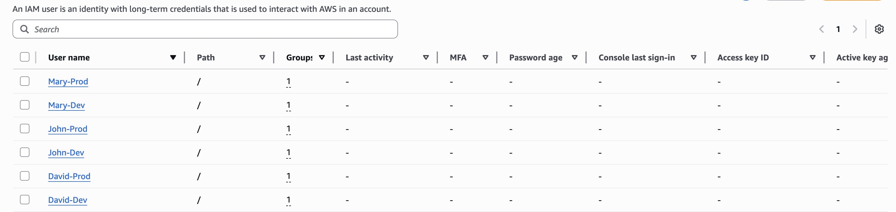
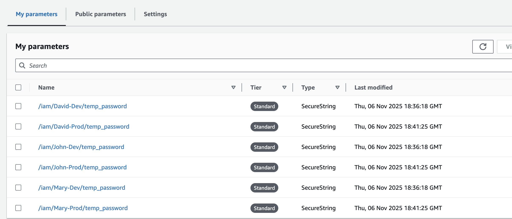

# IAM Account

Terraform project for managing IAM users with group-based permissions across dev/prod environments.

## Quick Start

```bash
# 1. Setup backend (once)
cd backend && terraform init && terraform apply && cd ..

# 2. Deploy IAM users to dev
cd deployments/dev
export AWS_PROFILE=your-admin-profile
terraform init
terraform apply

# 3. Get user passwords
aws ssm get-parameter --name "/iam/John-Dev/temp_password" --with-decryption --query "Parameter.Value" --output text

# Note: Console access must be enabled manually via AWS CLI or Console
```

## Structure

```
backend/          # S3 + DynamoDB (see backend/README.md)
modules/iam_user/ # IAM user module (see modules/iam_user/README.md)
deployments/dev/  # Dev environment
deployments/prod/ # Prod environment
```

## Result

After deployment, you'll have IAM users created across environments:



Passwords are securely stored in AWS Systems Manager Parameter Store:



## Usage

### Configure Users

Edit `deployments/dev/terraform.tfvars`:

```hcl
environment = "dev"

groups = {
  "Admins" = {
    policy_arn = "arn:aws:iam::aws:policy/AdministratorAccess"
    role       = "Administrator"
    users      = ["John-Dev", "Mary-Dev"]
  }
  "PowerUsers" = {
    policy_arn = "arn:aws:iam::aws:policy/PowerUserAccess"
    role       = "Power User"
    users      = ["David-Dev"]
  }
}
```

### Deploy

```bash
# Dev
cd deployments/dev
terraform apply

# Prod
cd deployments/prod
terraform apply
```
